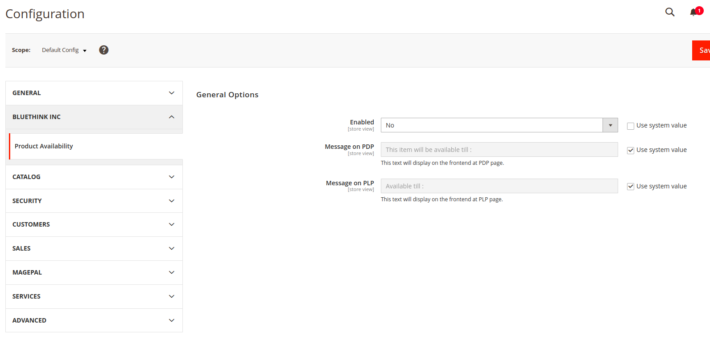
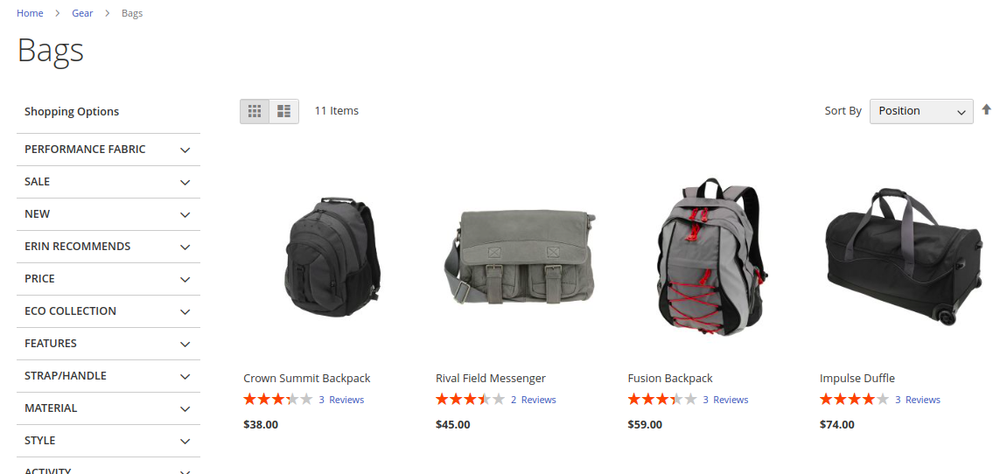
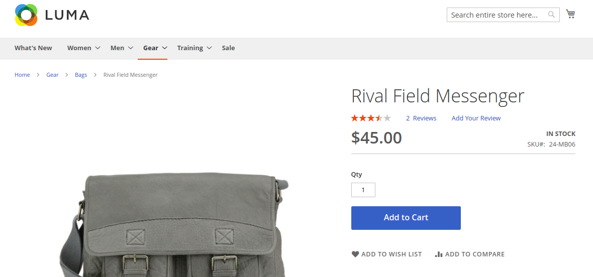
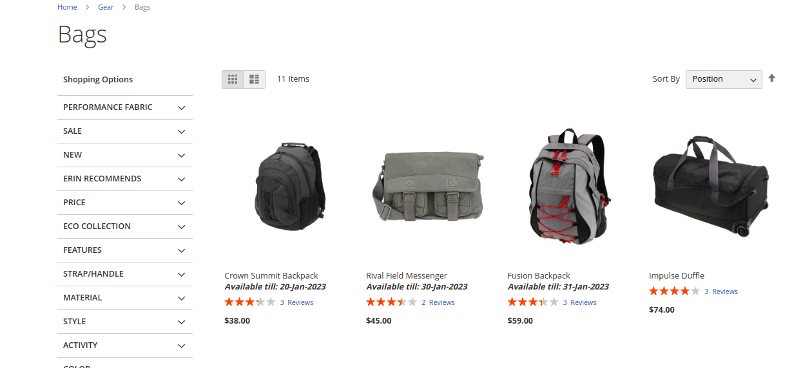
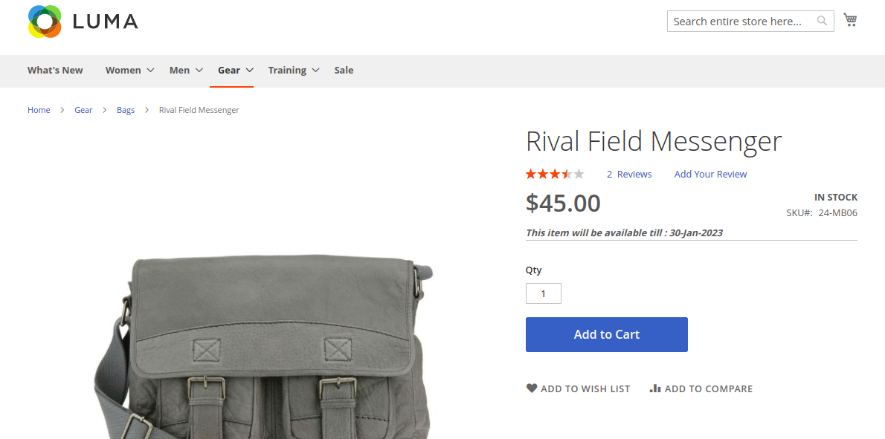

# Mage2 Module Bluethinkinc ProductAvailability

    ``bluethinkinc/magento2-module-product-availability``

## Main Functionalities
This extension is about displaying the message for availability of product at PDP.
If the product exceeds the availability date, it will not be visible on the entire store and the
status of the product will be disabled in the admin grid.

## Installation
\* = in production please use the `--keep-generated` option

### Type 1: Zip file

 - Download .zip file and extract to `app/code/Bluethinkinc` folder. If Bluethinkinc folder does not exist then create it in your `app/code` folder
 - Enable the module by running `php bin/magento module:enable Bluethinkinc_ProductAvailability`
 - Apply database updates by running `php bin/magento setup:upgrade`
 - Compilation by running `php bin/magento setup:di:compile`
 - Static Content deploy by running `php bin/magento setup:static-content:deploy`
 - Flush the cache by running `php bin/magento cache:flush`

### Type 2: Composer

 - Make the module available in a composer repository for example:
    - private repository `repo.magento.com`
    - public repository `packagist.org`
    - public github repository as vcs
 - Add the composer repository to the configuration by running `composer config repositories.repo.magento.com composer https://repo.magento.com/`
 - Install the module composer by running `composer require bluethinkinc/magento2-module-product-availability`
 - enable the module by running `php bin/magento module:enable Bluethinkinc_ProductAvailability`
 - apply database updates by running `php bin/magento setup:upgrade`
 - Compilation by running `php bin/magento setup:di:compile`
 - Static Content deploy by running `php bin/magento setup:static-content:deploy`
 - Flush the cache by running `php bin/magento cache:flush`

## Configuration

 - For setting to set availability message and enable module. Go to (Magento Admin -> Stores -> Configuration -> Product Availability -> General -> General Options)
 
 - Type the message you want to displayed at PDP.

## Preview Before

 - Category Listing page before module enabled
 

 - Product Detail Page before module enabled
 

## Preview After

 - Category Listing page after module enabled
 

 - Product Detail Page after module enabled
 

## Attributes

 - Product - Product Availability (product_availability)
